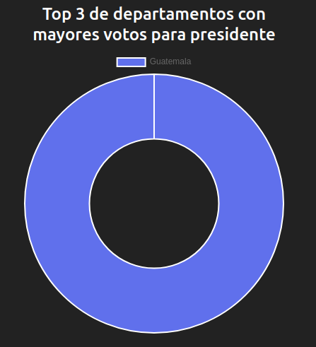
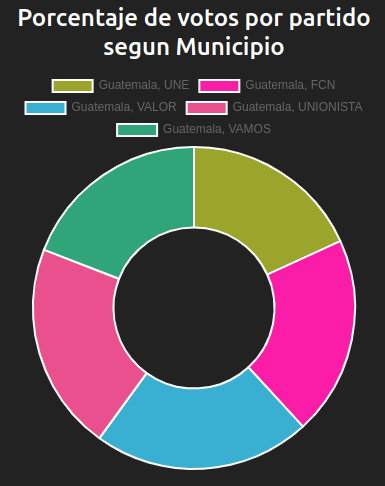
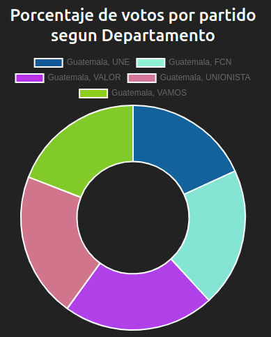
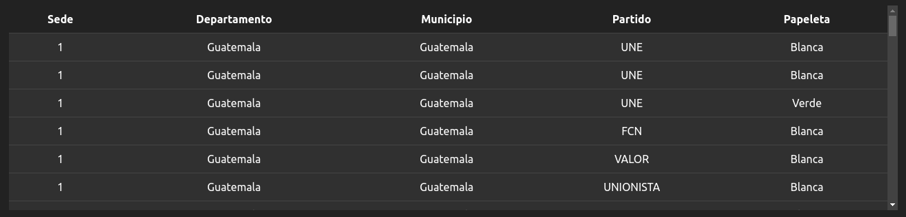
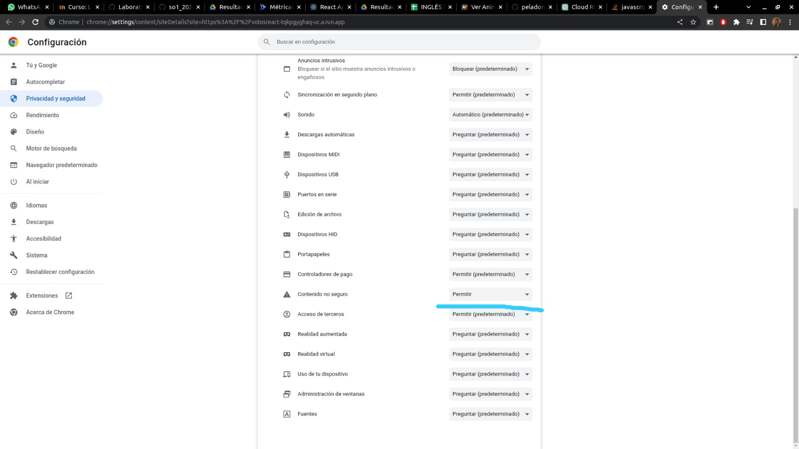

# Proyecto_SO1_G33

El proposito de la practica es comprender la concurrencia y la teoria del paralelismo para desarrollar sistemas distribuidos; experimeta

## Manual Tecnico  

| Servicio | Manual |
| ------ | ------ |
| API | [Api/README.md](Api/README.md) |
| FRONTEND | [frontend/README.md](frontend/README.md) |
| GRPC CLIENT | [gRPC/Client/README.md](gRPC/Client/README.md) |
| GRPC SERVER | [gRPC/Server/README.md](gRPC/Server/README.md) |
| MYSQL | [Database/README.md](SQL/README.md) |
| LOCUST | [Database/README.md](locust/README.md) |
| k8s | [k8s/README.md](k8s/README.md) |

---
## Manual Usuario
La aplicacion unicamente cuenta de unica ventana la cual muestra los datos ingresados dentro de las bases de datos.

Para acceder a la web ingrese en el sigueinte link: 
*https://votosreact-tqkpgyghaq-uc.a.run.app*

Una vez dentro del sitio podra visualizar un dashboard con multiples graficas y una grafica la cual presentan diferentes estadisticas con el total de votos y porcentajes de cada una de las metricas solicitadas.

### Top 3 de departamentos con mayores votos para presidente

### Porcentaje de votos por partido segun Municipio

### Porcentaje de votos por partido segun Departamento

### Tabla con todos los votos ingresados

En caso de que la informacion en las graficas o tabla no se cargue debe ir a configuraciones del sitio y perimitir el contenido no seguro.

